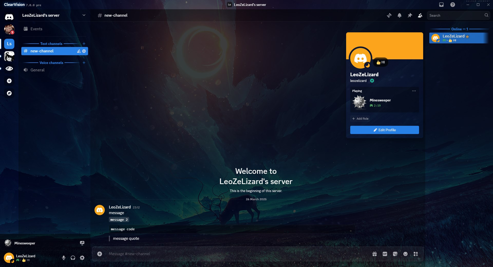
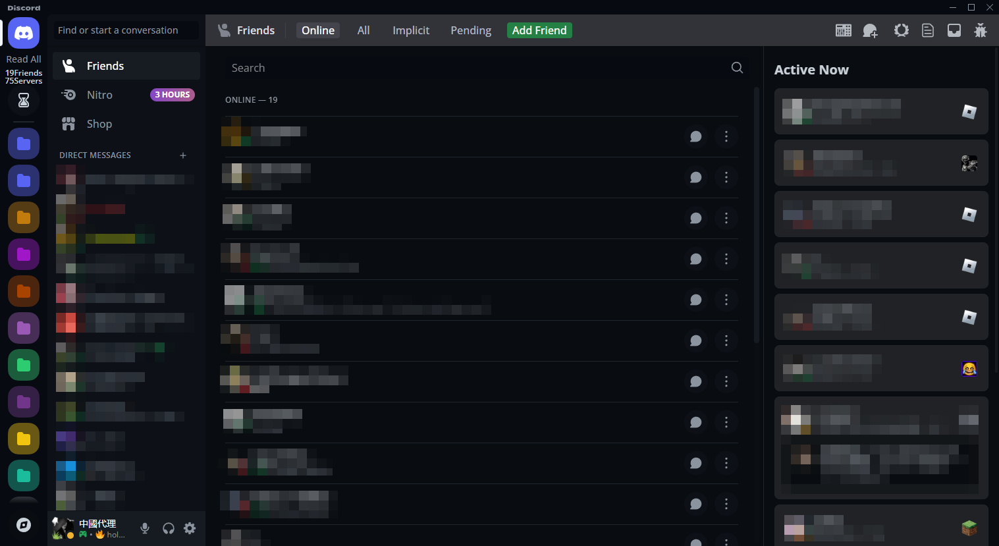
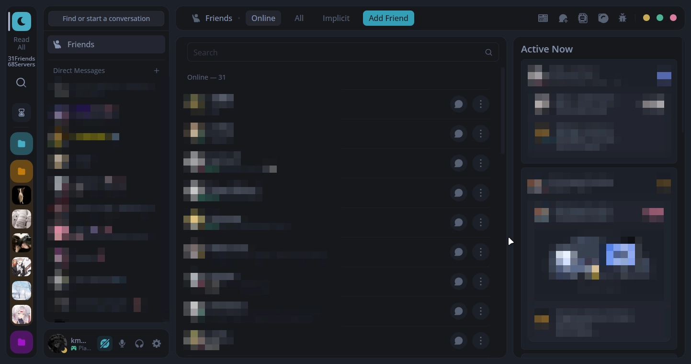
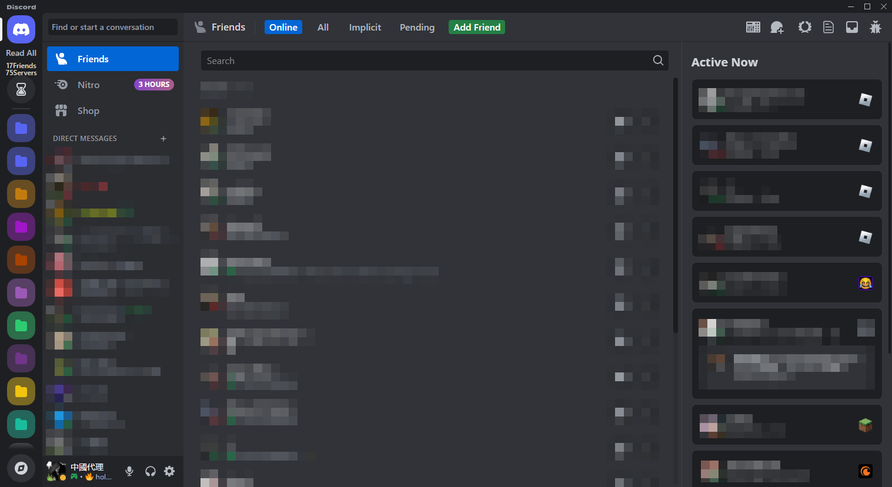
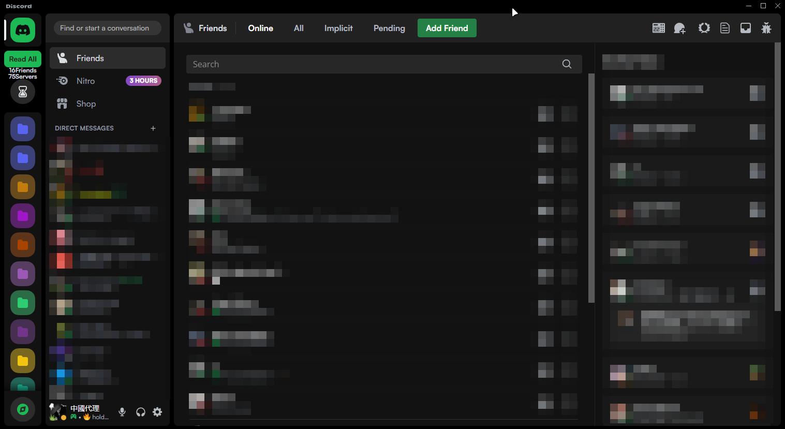
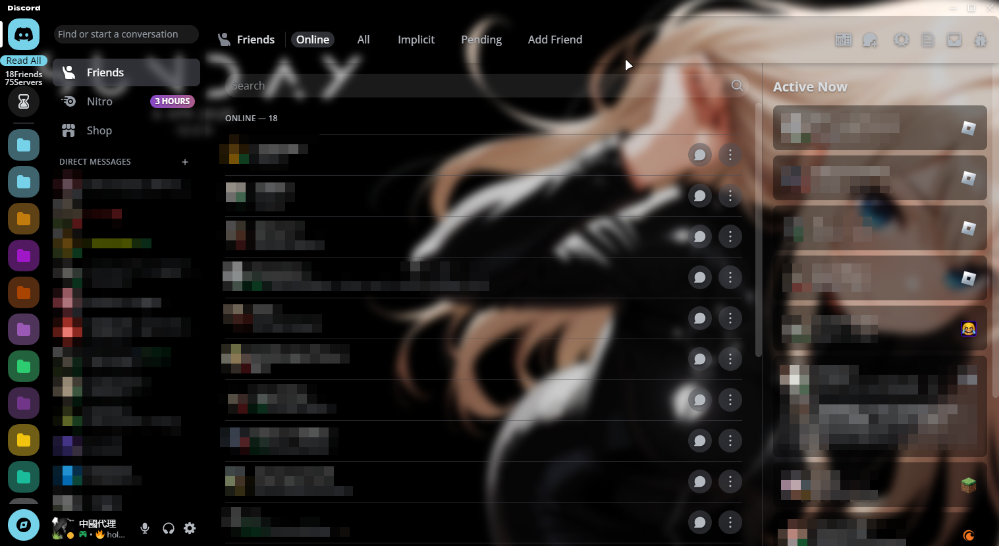

# BetterDiscord/Vencord themes
 Every theme have credits and can be used by everyone! 
 This repository is only to get easy acces to them. 
 In time changes to [fixes-for-old-Ui.css][def]. 

[def]: https://github.com/kmmiio99o/Themes/blob/main/fixes-for-old-UI.css

Amoled cord

Clear vision

Github dark

Material discord

Midnight (Bugged like on screen)

fixes for old UI

Slate

Spotify

Transparent (Must use [Mica for everyone][def] for better experience)

[def]: https://github.com/MicaForEveryone/MicaForEveryone