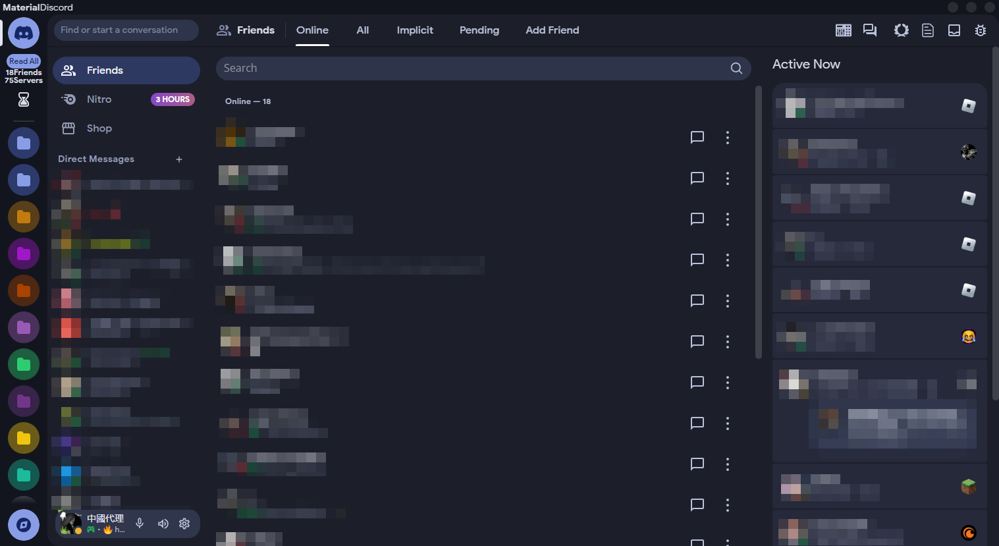

# BetterDiscord/Vencord Themes

Welcome to the repository of themes for BetterDiscord and Vencord! Each theme includes credits and is available for everyone to use. Below, you'll find a list of available themes along with their descriptions and screenshots.

## List of Themes

Better-UI (Optimized)

- **Description**: A theme designed for better performance and user convenience.
- **Default Discord theme**: Dark.
- **Screenshot**:
  

Amoled Cord

- **Description**: A dark-themed design, perfect for users who prefer dark modes.
- **Default Discord theme**: Onyx.
- **Link**: https://github.com/LuckFire/amoled-cord
- **Screenshot**:
  

Compact Cord

- **Description**: A lightweight theme with a compact layout. Note: may have issues with Spotify controls and plugins.
- **Screenshot**:
  

Clear Vision (New version 7.0! And laggy)

- **Description**: A modern and clean theme.
- **Screenshot**:
- **Link**: https://github.com/ClearVision/ClearVision-v7
  

Github Dark

- **Description**: A theme inspired by GitHub's dark mode.
- **Link**: https://github.com/moistp1ckle/GitHub_Dark
- **Screenshot**:
  

Material Discord

- **Description**: A theme inspired by Material Design.
- **Link**: https://github.com/CapnKitten/Material-Discord
- **Screenshot**:
  

Midnight

- **Description**: A dark-themed design, but may contain bugs as shown in the screenshot.
- **Link**: https://github.com/refact0r/midnight-discord?tab=readme-ov-file
- **Screenshot**:
  

Fixes for Old UI (Discontinued)

- **Description**: This theme is no longer supported due to Discord's UI refresh.
- **Screenshot**:
  

Slate(Discontinued)

- **Description**: A minimalist theme with gray accents.
- **Link**: https://github.com/DiscordStyles/Slate
- **Screenshot**:
  

Spotify

- **Description**: A theme inspired by Spotify's interface.
- **Link**: https://github.com/CapnKitten/Spotify-Discord
- **Screenshot**:
  

## Notes

- All themes are available for public use.
- For questions or issues, please contact the author.
