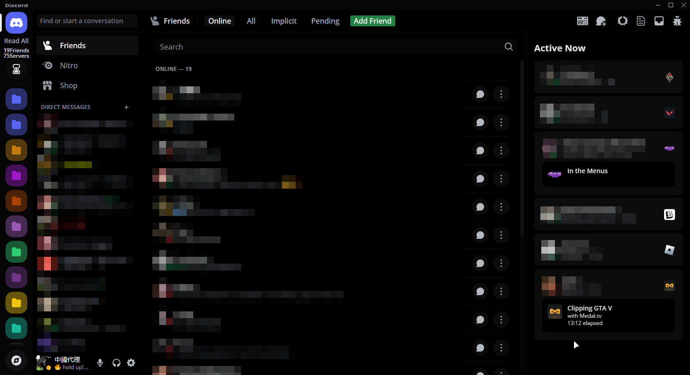

# BetterDiscord/Vencord themes
 Every theme have credits and can be used by everyone! 
 This repository is only to get easy acces to them. 
 ALL SCREEN'S I MADE ON OLD UI CAN BE BUGGY OR EVEN BROKEN 
I CAN'T SAID THEY ARE GOING TO WORK 100% FINE.

[def]: https://github.com/kmmiio99o/Themes/blob/main/fixes-for-old-UI.css

Better-UI (Good optimized)

 Theme on discord I used is 'dark' 

Amoled cord

Compact Cord

Clear vision

Github dark

Material discord

Midnight (Bugged like on screen)

fixes for old UI (Closed)

 It's not possible to use this theme, because discord gived fully refreash UI 

Slate

Spotify

Transparent 'Must use Mica for everyone' for better experience)

 Link to Mica for everyone: https://github.com/MicaForEveryone/MicaForEveryone. 
 Theme in the background is my own on pc! 

